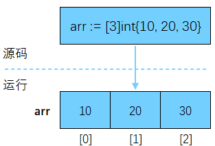

# 数组

数组（Array）是一种线性表数据结构。它用一组连续的内存空间，来存储一组具有相同类型的数据。Go 中的数组其实是和字符串一样的序列类型，不同于字符串在内存中连续存储字符，数组用[]语法将同一类型的多个值存储在一组连续内存中。

数组可具有零个或多个元素，且必须在声明或初始化时定义大小。 此外，数组一旦创建，就无法调整大小。 鉴于这些原因，数组在 Go 中并不常用，却是切片和映射的基础。

## 声明

在 Go 语言中，数组使用中括号+元素类型的形式进行声明：

```go
func main() {
  var names [3]string // 长度为3 元素类型为string
  var ages [3]int
  fmt.Println(names) // [  ]
  fmt.Println(ages)  // [ 0 0 0 ]
}
```

声明数组时只指定数组长度和类型，而不指定具体的初始化值，此时，数组会被初始化为其元素类型的[零值](/go/basics/variables-in-go)。

可以在声明数组时为其提供一组初始值，从而在数组创建之初就将其元素初始化为指定值。

```go
func main() {
  var names = [3]string{"张三", "李四", "王五"}
  ages := [3]int{18, 19, 20} // 不想写var，可以使用短变量声明语法
  fmt.Println(names)         // [张三 李四 王五]
  fmt.Println(ages)          // [18 19 20]
}
```

如果懒得算有几个数组元素，可以使用省略号 (...)，它会自动推导数组长度：

```go
func main() {
  ages := [...]int{18, 19, 20, 21}
  fmt.Println(ages) // [18 19 20 21]
}
```

我们还可以通过索引来初始化数组：

```go
func main() {
	names := [...]string{2: "张三", 0: "李四", 1: "王五"}
	fmt.Println(names) // [李四 王五 张三]
}
```

## 赋值

可采用下标表示法访问数组中的每个元素，其中第一个元素是 0，最后一个元素是数组长度减 1。读写操作不能超出数组的索引范围，也不能使用负数索引：

```go
func main() {
	arr := [3]int{10, 20, 30}
	arr[0] = 100          // 写入
	fmt.Println(arr[0])   // 读取 100
	fmt.Println(len(arr)) // 数组长度 3

	// arr[5]=100 // 超出数组索引范围，会导致panic
	// arr[-1]    // 数组下标不能为负数，会导致panic
}
```

计算机会给每个内存单元分配一个地址，然后通过地址来访问内存中的数据。当计算机需要随机访问数组中的某个元素时，会首先通过寻址公式计算出该元素存储的内存地址：`arr[i]_address = base_address + i * data_type_size`，这也就是为什么大多数编程语言中，数组要从 0 开始编号，而不是从 1 开始。所以，数组支持随机访问，根据下标随机访问的时间复杂度为 O(1)。



## 截取

```go
func main() {
	arr := [...]int{0, 1, 2, 3, 4}
    // arr[开始索引(包含): 结束索引(不包含)]
	fmt.Println(arr[1:2]) // [1]
	fmt.Println(arr[1:])  // [1 2 3 4]
	fmt.Println(arr[:2])  // [0 1]
	fmt.Println(arr[:])   // [0 1 2 3 4]
}
```

## 遍历数组

```go
func main() {
  ages := [...]int{18, 19, 20}
  for i, v := range ages {
    fmt.Println(i, v)
  }
}
```

## 多维数组

Go 是支持多维数组的，这里我们声明并初始化一个二维数组：

```go
func main() {
	arr := [2][3]int{{1, 2, 3}, {4, 5, 6}}
	fmt.Println(arr) // [[1 2 3] [4 5 6]]
	// 第1维可用...推测，第2维不行
	arr2 := [...][3]int{{1, 2, 3}, {4, 5, 6}}
	fmt.Println(arr2) // [[1 2 3] [4 5 6]]

	for _, row := range arr {
		for _, col := range row {
			fmt.Printf("%d ", col)
		}
	}
}
```
