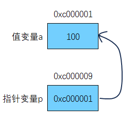

# 指针

在 Go 中，指针是一种特殊变量，它存储的不是一个普通值，而是另一个变量的内存地址。如果一个变量存储了一份数据的指针，称为指针变量。

Go 中的指针与其他编程语言有所不同。Go 的指针既没有像 Java 语言那样取消了对指针直接操作的能力，也避免了 C/C++ 语言中由于对指针的滥用而造成安全和可靠性问题。

- 默认值 nil
- 不支持指针运算

指针使得开发人员可以直接操作内存空间，能够有效地提升程序的执行性能。

## 声明

在 Go 中，用`*`来声明一个指针类型变量。

```go
func main() {
	var p *int
	fmt.Println(p) // <nil>
}
```

声明一个指针类型变量但没有进行显示初始化，会被自动赋予一个默认值 nil（空指针），nil 是不能直接赋值的。

## 初始化

方式一：

```go
func main() {
	a := 100
	p := &a            // 将 p 初始化为 a 的地址
	fmt.Println(p, *p) // 0xc00000a0d8 100
}
```

方式二，通过内置 new 函数来声明并初始化指针变量，其创建一个对应类型的指针，创建过程会在 heap 堆上分配内存，被创建的指针指向零值：

```go
func main() {
	p := new(int)
	fmt.Println(p, *p) // 0xc00000a0c8 0
}
```

通过内建函数 new 返回一个指向新分配类型为 int 的指针，指针值为 0xc00000a0c8，这个指针指向的内容值为零。

## new 与 make 区别

1. 二者都是用来做内存分配
2. make 只用于 slice、map 以及 channel 初始化，返回引用类型本身
3. 而 new 用于类型的内存分配，并且内存对应的值为类型零值，返回指向类型的指针

## 指针本质

本质上，值类型和指针类型都是存储的二进制数据，只是运行时处理方式有所不同。如果一个变量是值类型，那么其存储内容被视作普通数据；而指针类型变量，其存储内容被解释为另外一块内存的首地址。



## 多级指针

```go
func main() {
	a := 100
	p := &a                       // 一级指针
	pp := &p                      // 二级指针
	ppp := &pp                    // 三级指针
	fmt.Println(*p, **pp, ***ppp) // 100 100 100
}
```

## 指针作为函数参数

假设想要对函数内部的数组进行一些更改，并且对函数内部数组所做的更改对调用者可见。一种方法是将一个指向数组的指针作为参数传递给函数：

```go
func modify(arr *[3]int) {
	arr[0] = 16
}

func main() {
	a := [3]int{18, 19, 20}
	modify(&a)
	fmt.Println(a) // [16 19 20]
}
```

另一种方法是传递一个切片给函数，这是 Go 中的惯用方法：

```go
func modify(sls []int) {
	sls[0] = 16
}

func main() {
	a := [3]int{18, 19, 20}
	modify(a[:])
	fmt.Println(a) // [16 19 20]
}
```
