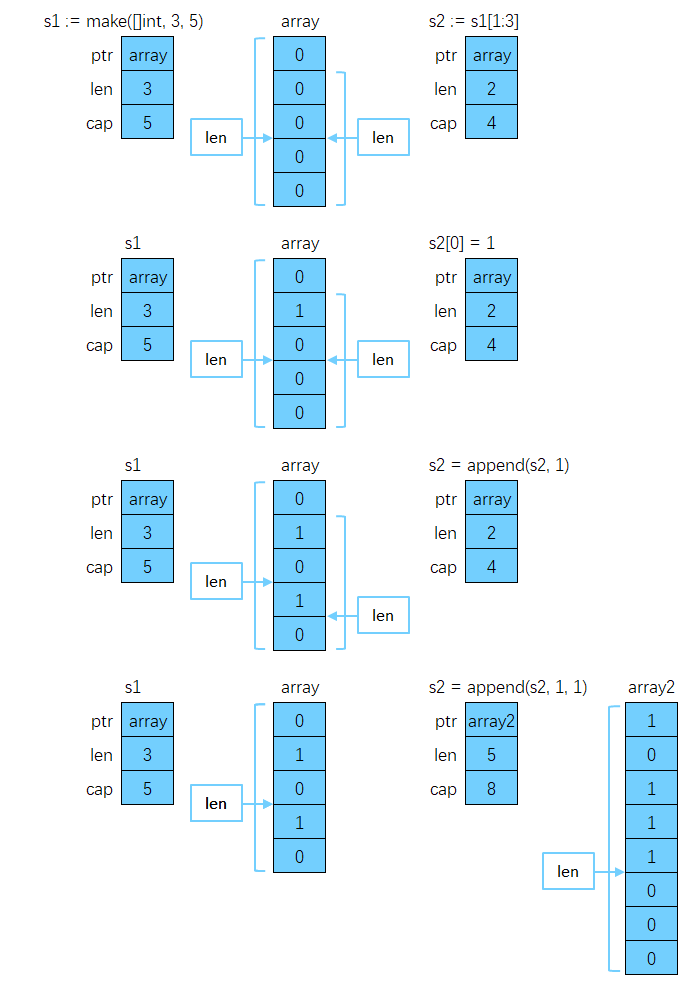

# 切片

Slices，中文翻译为“切片”，在 Go 中不是[数组](/go/basics/arrays-in-go)，而是一个[结构体](/go/basics/structs-in-go)，其定义（runtime 包下的 slice.go）如下：

```go
type slice struct {
	array unsafe.Pointer // 指向数组起始地址的指针
	len   int            // length 数组长度
	cap   int            // capacity 数组容量
}
```

切片可看成是动态数组，是对数组的引用，即数组的视图。因为数组长度是固定的，所以操作起来很不方便，在开发中数组并不常用，切片才是大量使用的。

## 声明

声明切片语法与声明数组类似，只是无须指定长度：

```go
func main() {
	var s []int
	fmt.Println(s, len(s), cap(s)) // [] 0 0
	fmt.Println(s == nil)          // true
	fmt.Printf("%#v", s)           // []int(nil)
}
```

如果一个切片没有被显式初始化，其值会是 nil。

## 初始化

方式一，使用字面量初始化：

```go
func main() {
	s := []int{1, 3, 5}
	fmt.Println(s, len(s), cap(s)) // [1 3 5] 3 3
	s2 := []int{1, 2: 3, 5, 10: 100}
	fmt.Println(s2, len(s2), cap(s2)) // [1 0 3 5 0 0 0 0 0 0 100] 11 11
}
```

方式二，从数组或切片上获得切片，使用的是半开区间：

```go
func main() {
	arr := [...]int{23, 24, 25, 26, 27}
	s := arr[:]
	fmt.Println(s, len(s), cap(s)) // [23 24 25 26 27] 长度5 容量5
	s2 := s[1:3]
	fmt.Println(s2, len(s2), cap(s2)) // [24 25] 长度2 容量4
	s3 := s[1:3:4]
	fmt.Println(s3, len(s3), cap(s3)) // [24 25] 长度2 容量3
}
```

切片名称[low : high : max]

- low：起始下标位置
- high：结束下标位置
- 长度：len = high - low
- 容量：cap = max - low

方式三，如果要在创建切片时为其指定初始大小和容量，可通过内置 make 函数来初始化切片：

```go
func main() {
	s := make([]int, 2, 10)
	fmt.Println(s, len(s), cap(s)) // [0 0] 2 10
}
```

2 为分配的元素数量，10 为预分配的元素数量，10 这个值只是提前分配空间，降低多次分配空间造成的性能问题。

## append

### 追加

```go
func main() {
	s := make([]int, 2, 3)
	fmt.Println(s, len(s), cap(s)) // [0 0] 2 3

	s1 := append(s, 1)
	fmt.Println(s1, len(s1), cap(s1)) // [0 0 1] 3 3

	s2 := append(s, 1, 2)
	fmt.Println(s2, len(s2), cap(s2)) // [0 0 1 2] 4 6 容量不够2倍扩容，此时底层数组已经发生改变

	s3 := append(s1, s2...)             // ...是解包操作
	fmt.Println(s3, len(s3), cap(s3)) // [0 0 1 0 0 1 2] 7 8
}
```

- 切片相对于数组最大的特点就是可以追加元素，可以自动扩容
- 追加的元素放到预留的内存空间里，同时 len 加 1
- 如果预留空间已用完，则会重新申请一块更大的内存空间：

  - 如果请求容量 > 2 倍现有容量，则新容量直接为请求容量，否则
  - 如果现有容量 < 256 ，则新容量是原来的两倍，否则
  - `新容量 = 1.25 * 现有容量 + 0.75 * 256`

- 把原内存空间数据拷贝过来，在新内存空间上执行 append 操作

### 插入

```go
func main() {
	s := []int{1, 2, 3}
	s = append([]int{0}, s...) // 开头添加元素
	fmt.Println(s)             // [0 1 2 3]

	i := 2
	x := 100
	s = append(s[:i], append([]int{x}, s[i:]...)...) // 在索引i处添加元素x
	fmt.Println(s)                                   // [0 1 100 2 3]
}
```

### 删除

删除 slice 中的元素，比较麻烦，因为 Go 语言中并没有删除切片元素的专用方法。

```go
func main() {
	s := []int{0, 1, 2, 3, 4}
	i := 1
	s = append(s[:i], s[i+1:]...) // 删除索引为1的元素
	fmt.Println(s)                // [0 2 3 4]
}
```

## 拼接

slices.Concat 切片拼接，是 go1.22 新特性。

```go
func main() {
	s1 := []int{1, 2, 3}
	s2 := []int{4, 5, 6}
	s3 := []int{7, 8, 9}
	merged := slices.Concat(s1, s2, s3)
	fmt.Println(merged) // [1 2 3 4 5 6 7 8 9]
}
```

## 拷贝

拷贝过程中，直接对应位置拷贝。

```go
func main() {
	s1 := []int{1, 2, 3, 4, 5}
	s2 := []int{11, 22, 33}
	copy(s1, s2)    // copy s2 to s1
	fmt.Println(s1) // [11 22 33 4 5]
	fmt.Println(s2) // [11 22 33]
}
```

## 排序

可以使用内置 sort 包对切片进行排序，对于 int、float64 和 string 数组或是切片的排序， Go 分别提供了 sort.Ints() 、sort.Float64s() 和 sort.Strings() 函数， 默认都是从小到大排序。

```go
func main() {
	s := []int{10, 1, 12, 8, 4}
	sort.Ints(s)
	fmt.Println(s) // [1 4 8 10 12]
	// 降序排序
	sort.Sort(sort.Reverse(sort.IntSlice(s)))
	fmt.Println(s) // [12 10 8 4 1]
}
```

## 切片本质

切片追加、修改元素实际都是在修改底层数组。

```go
func main() {
	s1 := make([]int, 3, 5)
	fmt.Println(s1, len(s1), cap(s1)) // [0 0 0] 3 5
	s2 := s1[1:3]
	fmt.Println(s2, len(s2), cap(s2)) // [0 0] 2 4

	s2[0] = 1
	fmt.Println(s1, len(s1), cap(s1)) // [0 1 0] 3 5
	fmt.Println(s2, len(s2), cap(s2)) // [1 0] 2 4

	s2 = append(s2, 1)
	fmt.Println(s1, len(s1), cap(s1)) // [0 1 0] 3 5
	fmt.Println(s2, len(s2), cap(s2)) // [1 0 1] 3 4

	s2 = append(s2, 1, 1)
	fmt.Println(s1, len(s1), cap(s1)) // [0 1 0] 3 5
	fmt.Println(s2, len(s2), cap(s2)) // [1 0 1 1 1] 5 8
}
```

- 刚开始，子切片和母切片共享底层的内存空间，修改子切片会反映到母切片上，在子切片上执行 append 会把新元素放到母切片预留的内存空间上
- 当子切片不断执行 append，耗完了母切片预留的内存空间，子切片跟母切片就会发生内存分离，此后两个切片没有任何关系



## 多维切片

二维数组各行列数必须相等，但二维切片各行 len 可以不等。

```go
func main() {
	s := [][]string{
		{"C", "C++"},
		{"JavaScript"},
		{"Go", "Rust"},
	}
	for _, v1 := range s {
		for _, v2 := range v1 {
			fmt.Printf("%s ", v2)
		}
		fmt.Printf("\n")
	}
}
```
