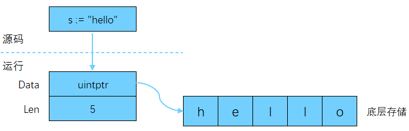

# 字符串

字符串是编程语言中很常见的数据类型。

## 字符串本质

在 Go 中，字符在内存中的存储结构是 UTF-8 转换后的结果。字符串在内存存储时，本质上是一个不可变的字节切片（slice of bytes），即将字符串按照 UTF-8 编码转化，生成字节切片，并将其存储在内存中。

字符串通过将一组字符括在双引号内来创建。

```go
func main() {
  s := "hello"
  fmt.Println(s) // hello
}
```

在 64 位系统上，字符串数据类型通常占用 16 字节空间，前 8 字节是一个指针，指向字符串底层数据的起始位置，后 8 字节是一个整数，标识字符串长度。



## 转义字符

在 Go 中，双引号是一个特殊字符。当编译器遇到双引号时，认为它是一个字符串定义的开始。要表示双引号的原义字符，就需要进行转义，即在双引号前增加反斜杠（`\"`）。

Go 中常见转义字符如下所示：

- `\n`：换行符（跳到下一行同列位置）
- `\r`：回车符（返回行首）
- `\t`：制表符
- `\'`：单引号
- `\"`：双引号
- `\\`：反斜杠自身
- `\u`或`\U`：Unicode 字符

```go
func main() {
  s := "h\te\nl\tl\no"
  fmt.Println(s)
  /* Output:
  h       e
  l       l
  o
  */
}
```

| 操作系统 | 回车换行 |
| -------- | -------- |
| Windows  | \r\n     |
| macOS    | \r       |
| Linux    | \n       |

## 多行字符串

有时，需要定义一个多行字符串，可使用反引号。反引号间换行将被作为字符串中的换行，但是所有的转义字符均无效，文本将会原样输出：

```go
func main() {
  s := `\n
h
i`
  fmt.Println(s)
  /* Output:
  \n
  h
  i
  */
}
```

### 原始字符串转解释字符串

例如，打印下面这个原始字符串时，与我们想要的结果不一样。

```go
func main() {
	s := `\033[1mString in bold.\033[0m`
	fmt.Println(s)
}
```

要将原始字符串更改为解释字符串，可使用 strconv 包。

```go
func main() {
	s := `\033[1mString in bold.\033[0m`
	sInterpreted, err := strconv.Unquote(`"` + s + `"`)
	if err != nil {
		panic(err)
	}
	fmt.Println(sInterpreted)
}
```

### 终端显示

终端显示字体背景和颜色可通过 ESC 字符（八进制\033） + `[` + `特殊属性;背景色;前景色` + `m`来实现，如`\033[1m`。

特殊属性：

- 0 终端默认设置（黑底白字）
- 1 高亮显示
- 4 使用下划线
- 5 闪烁
- 7 反白显示
- 8 不可见

背景色范围 40-49：

- 40：黑
- 41：红
- 42：绿
- 43：黄
- 44：蓝
- 45：紫
- 46：深绿
- 47：白色

前景色范围 30-39：

- 30：黑
- 31：红
- 32：绿
- 33：黄
- 34：蓝
- 35：紫
- 36：深绿
- 37：白色

光标位置格式控制：

- \033[nA 光标上移 n 行
- \03[nB 光标下移 n 行
- \033[nC 光标右移 n 行
- \033[nD 光标左移 n 行
- \033[y;xH 设置光标位置
- \033[2J 清屏
- \033[K 清除从光标到行尾的内容
- \033[s 保存光标位置
- \033[u 恢复光标位置
- \033[?25l 隐藏光标
- \33[?25h 显示光标

## 字符串常用操作

### 字符串长度

len 函数返回字节（byte）数，而非字符数。如果需要获取字符数，可以使用函数 utf8.RuneCountInString() 来获取字符串实际字符数。

```go
func main() {
	s := "Go语言"
	fmt.Println("字节数:", len(s)) // 字节数: 8
	fmt.Println("字符数:", utf8.RuneCountInString(s)) // 字符数: 4
}
```

### 遍历字符串

```go
func main() {
	s := "Go语言"

	fmt.Printf("字节: ")
	for i := 0; i < len(s); i++ {
		fmt.Printf("%X ", s[i]) // 47 6F E8 AF AD E8 A8 80
	}

	fmt.Printf("\n字符: ")
	runes := []rune(s)
	for i := 0; i < len(runes); i++ {
		fmt.Printf("%c ", runes[i]) // G o 语 言
	}

	fmt.Printf("\n字符: ")
	for _, rune := range s {
		fmt.Printf("%c ", rune) // G o 语 言
	}

	fmt.Printf("\n字节: ")
	for _, rune := range s {
		fmt.Printf("%X ", rune) // 47 6F 8BED 8A00
	}
}
```

### 从切片创建字符串

```go
func main() {
	byteSlice := []byte{0x47, 0x6F, 0xE8, 0xAF, 0xAD, 0xE8, 0xA8, 0x80}
	str := string(byteSlice)
	fmt.Println(str) // Go语言

	runeSlice := []rune{0x47, 0x6F, 0x8BED, 0x8A00}
	str = string(runeSlice)
	fmt.Println(str) // Go語言
}
```

### 字符串拼接

最简单的方法是使用 + 操作符。

```go
func main() {
	string1 := "Go"
	string2 := "语言"
	result := string1 + " " + string2
	fmt.Println(result) // Go 语言

	result = fmt.Sprintf("%s %s", string1, string2)
	fmt.Println(result) // Go 语言
}
```

当有大量的字符串需要拼接时，使用 strings.Builder 效率会更高。

```go
func main() {
	var builder strings.Builder
	builder.WriteString("Go")
	builder.WriteString(" ")
	builder.WriteString("语言")
	r := builder.String()
	fmt.Println(r) // Go 语言
}
```

### 更改字符串

字符串是不可变的。一旦创建了字符串，就不能更改它。想要更改字符串，需先将其转换成 []rune 或 []byte，更改完成后再转换为 string。无论哪种转换，都会重新分配内存，并复制字节切片。

```go
func main() {
	str := "big"
	s := []byte(str)
	s[0] = 'p'
	fmt.Println(string(s)) // pig

	str = "李小龙"
	s2 := []rune(str)
	s2[1] = '大'
	fmt.Println(string(s2)) // 李大龙
}
```

### 其他操作

分割：strings.Split

包含：strings.Contains

替换：strings.Replace

大小写：strings.ToUpper，strings.ToLower

前后缀：strings.HasPrefix，strings.HasSuffix

去除前后缀：strings.Trim

出现次数：strings.Count

子串出现位置：strings.Index，strings.LastIndex

拼接：strings.Join
